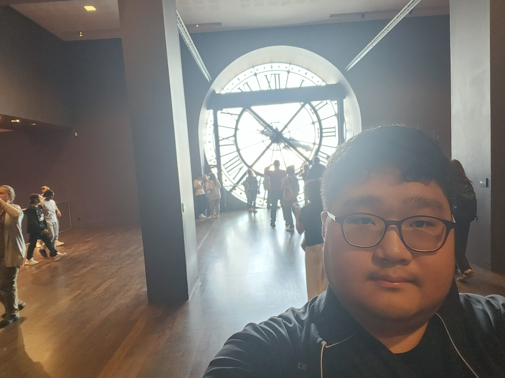

# 
 Gwantae Kim 

**Staff Engineer, Samsung Electronics, Mobile eXperience (MX) Division, AP R&D Team**  
**Ph. D. in video information processing, Korea University**  

[email](kgt1103211@gmail.com)  
[github](https://github.com/GT-KIM)  
[scholar](https://scholar.google.com/citations?user=kgt1103211)

## Research Interests
### Multimodal Agentic AI

## Work Experience
- Staff Engineer, Samsung Electronics, Mobile eXperience (MX) Division, AP R&D Team
  - 2024.09 ~ Current (9 months)
  - Position: Ondevice AI (Mobile), NPU/AI
 
- Postdoctoral Researcher, Korea University (2024.03 ~ 2024.08, 6 months)

- Dispatched Researcher, Brand Engagement Network (2023.11 ~ 2024.07, 8 months)

## Academic
- Ph. D., Video Information Processing, Korea University
  - 2018.09 ~ 2024.02 (5 years, 6 months)
  - Thesis: Deep learning based perception, thinking, and generation for natural human-computer interaction
  - Grade: 4.33
- B. S., Mechanical Engineering (Major) Autonomous Driving (Minor), Korea Aerospace University
  - 2014.03 ~ 2018.08 (4 years, 6 months)
  - Grade: 3.65

## Current Projects
### Projects

### Personal Projects
- Multimodal Human-AI Interaction
- Sound Event Localization & Detection (DCASE Challenge task 3)

## Previous Projects
### Funded Projects
- AI assistant
- Development of Cognitive/Response Advancement Technology for AI avatar Commercialization
- Deep Learning-based Emotional Intelligent Agent Technology for Human-Computer Interaction
- Perception/Response Technology Research for AI avatar
- Development of AI Avatar for AI assistant
- Seismic Event Detection & Classification
  
  - 2018.09 ~ 2021.12 (2 years 6 months)
  - Funding (Meteorological/Earthquake See-At Technology Development Research under Grant KMI2018-09610)
  - Project Overview
    eeee
  - Publications
    - 1

### Personal Projects
- Single Image Super Resolution (NTIRE Challenge)
- Reinforcement Learning Applications
- English/Korean Speech Synthesis
- Sound Source Localization (Audio & Speech)
- Video to Text (TRECVID Challenge)
- Generation and Evaluation of Non-verbal Behaviour for Embodied Agents (GENEA Challenge)

## Teaching
- Teaching Assistant, Virtual Reality System (VIP701), Korea University, 2023.03 ~ 2023.08
- Teaching Assistant, Capstone Design, Korea University, 2023.03 ~ 2023.08
- Teaching Assistant, Digital System Experiment (KECE210-05), Korea University, 2020.09 ~ 2021.02
- Teaching Assistant, Capstone Design, Korea University, 2019.09 ~ 2020.02

## Academic Contributions
- IEEE Member
- Techinal Committee, Machine Learning, Deep Learning and AI in CE(MDA), IEEE Consumer Technology Society (CTSoc)([Link](https://ctsoc.ieee.org/technical/technical-committees/mda-tc.html?view=article&id=310:mda-tc-members&catid=21))
- Reviewer (ICASSP, Interspeech, IJCNN, SpringerNature, ...)
- Student Volunteer (ICASSP, Interspeech)

## Extracurricular Activity
- Aircraft Manufacturing Society for Research (AMSR), Korea Aerospace University
  - 2014.03 ~ 2018.08 (4 years, 6 months)
  - Overview
    - Studying and Manufacturing Unmanned Aerial Vehicle (UAV)
    - Making Automatic Control System for Fixed-wing Aircraft and Drone
